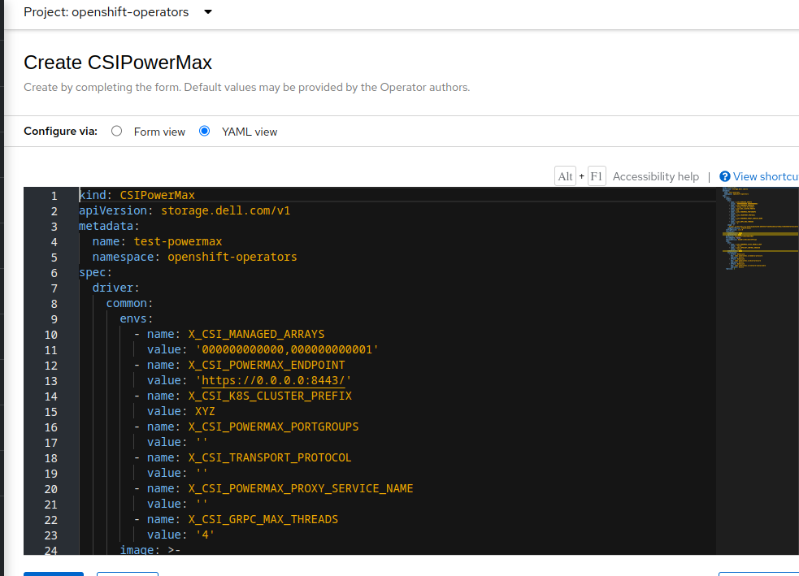

# How to configure Dell FC Powermax for Persistent Storage on Openshift 4 


Red Hat OpenShift Container Platform supports the use of Fibre Channel (FC) based storage that allows users to provision volumes based on it. The Kubernetes persistent volume framework allows users to request those resources without knowledge of the underlying storage infrastructure. 

This article provides information on how we can configure and use Dell’s [Powermax Storage](https://www.dell.com/en-au/dt/storage/powermax.htm#tab0=0) on OpenShift 4 clusters with the help of the Dell CSI Operator. The Dell Powermax in addition has the capabilities for expansion and snapshots of volumes provisioned of it. 

The Dell CSI Operator is a Kubernetes Operator, which can be used to install and manage the CSI Drivers provided by Dell for various storage platforms. This operator is available as a community operator and certified operator for OpenShift clusters and can be deployed using the OpenShift Container Platform. Both these methods of installation use OLM (Operator Lifecycle Manager). The operator can also be deployed manually.


### Prerequisites

Before we proceed with the installation of the Operator, the following prerequisites are required as part of the installation.


#### Multipath

Multipath configured across all compute nodes.

- Create the base64 contents for multipath configuration as follows

```yaml
echo 'defaults {
user_friendly_names yes
find_multipaths yes
}
blacklist {
}' | base64 -w0
ZGVmYXVsdHMgewoKdXNlcl9mcmllbmRseV9uYW1lcyB5ZXMKCmZpbmRfbXVsdGlwYXRocyB5ZXMKCn0KCmJsYWNrbGlzdCB7Cgp9Cg==
```

- Create a MachineConfig file and specify the above contents to it. 

```yaml
apiVersion: machineconfiguration.openshift.io/v1
kind: MachineConfig
metadata:
  name: multipath-conf-default
  labels:
    machineconfiguration.openshift.io/role: worker
spec:
  config:
    ignition:
      version: 3.1.0
    storage:
      files:
      - contents:
          source: data:text/plain;charset=utf-8;base64,ZGVmYXVsdHMgewoKdXNlcl9mcmllbmRseV9uYW1lcyB5ZXMKCmZpbmRfbXVsdGlwYXRocyB5ZXMKCn0KCmJsYWNrbGlzdCB7Cgp9Cg==
          verification: {}
        filesystem: root
        mode: 400
        path: /etc/multipath.conf
```

```bash
# oc apply -f machineconfig.yaml 
```

This triggers an mcp update and you can find all the nodes in updating state for which the changes are being applied and then the nodes being restarted. This enables and starts the service on the compute nodes. 

#### Secret
- We are required to configure the secret with user access to the Powermax management console.
NOTE: The secret needs to be configured with the name powermax-creds.

```yaml
apiVersion: v1
kind: Secret
metadata:
  name: powermax-creds
  namespace: dell-storage-powermax
type: Opaque
data:
  # specify base64 creds 
  username: <base64 contents of username>
  password: <base64 contents of password>
```

This is created into the namespace dell-storage-powermax in our case that we will be using for deploying our Powermax custom resource that was previously created. 

## Installation

The installation of the operator in OCP4 can be done directly from the OperatorHub. Once selected, we can proceed with the Install of the operator to all the namespaces with it installed on the NS openshift-operators. This starts the operator pod in the namespace

```yaml
❯ oc get pods -n openshift-operators
 
NAME                                                   READY   STATUS    RESTARTS   AGE
 
dell-csi-operator-controller-manager-9ff7f55bc-96hgw   1/1     Running   0          7m48s
```

The installation of the Operator provides us with the API functionalities or CRD’s configured for the following resources
- CSI PowerScale
- CSI PowerMax
- CSI PowerMax ReverseProxy
- CSI PowerStore
- CSI Unity XT
- CSI PowerFlex

In our case, we will be configuring CSI Powermax for this. 

## Configuration

### Custom Resource - PowerMax
Next, we are required to create the Powermax custom resource that includes information about the array details, management endpoint Address, 3 letter keyword as cluster prefixes for volumes provisioned by the storage and transport protocol. This can be done either via the UI or console having included the necessary information .


This will create the powermax controller pods along with powermax pods running on each of the compute nodes. If you have multiple compute nodes for different roles or purposes, it would be best to configure a nodeselector on the project and add the label to the nodes so that the powermax pods are only running on them specifically or this can be achieved using the node topology keys.
 
```bash

$ oc get pods -n dell-storage-powermax

NAME                                                                      READY   STATUS    RESTARTS   AGE

powermax-controller-332f6cvf-453ff              5/5     Running   0          101s
powermax-controller-332f6cvf-ser34              5/5     Running   0          101s
powermax-node-594v4                                         2/2     Running   0          101s
powermax-node-r8tgl                                            2/2     Running   0          101s
powermax-node-rkm7g                                         2/2     Running   0          101s
```

The logs for the container driver in powermax-node when accessed will be having information on the HBA’s being discovered and logging into these devices. 


### StorageClass

We can now proceed with the installation of the SC based on the YAML file below or from the UI where the provisioner needs to be specified as CSI powermax. The storage filesystem type if not specified resorts to ext4 by default. 


```yaml
apiVersion: storage.k8s.io/v1
kind: StorageClass
metadata:
  name: powermaxsc
parameters:
  csi.storage.k8s.io/fstype: xfs
  SRP: SRP_1
  SYMID: "000497600159"
  ServiceLevel: “Diamond”
provisioner: csi-powermax.dellemc.com
reclaimPolicy: Delete
volumeBindingMode: WaitForFirstConsumer
allowVolumeExpansion: true
```
  The above SC yaml can be applied on the cluster 

```bash

$ oc apply -f storage_class.yaml

$ oc get sc
 
NAME                      PROVISIONER                    AGE
powermaxsc      csi-powermax.dellemc.com   50s
```


This creates the StorageClass on the cluster with CSI Powermax. 


### Provisioning FC Volumes

With the storage class made available to all users, this allows the provision of FC volumes of it. 
Once you create a PVC, this will be in WaitForFirstConsumer state till it gets attached to a pod. 


```yaml
# Create a PVC 
apiVersion: v1
kind: PersistentVolumeClaim
metadata:
  name: fc-powermax-volume-1
  namespace: my-test-namespace
spec:
  accessModes:
  - ReadWriteOnce
  resources:
    requests:
      storage: 5Gi
  storageClassName: powermaxsc


```   
   
```bash
$ oc create -f pvc.yaml
$ oc get pvc -n my-test-namespace

NAME                             STATUS                           VOLUME            CAPACITY     ACCESS MODES   STORAGECLASS   AGE
fc-powermax-volume-1 WaitForFirstConsumer                               5Gi                     RWO             powermaxsc

```


```yaml
# Create a pod and attach the volume.

apiVersion: v1
kind: Pod
metadata:
  name: example
  namespace: my-test-namespace
spec:
  containers:
  - name: test-pvc-powermax
    image: quay.io/centos/centos
    ports:
      - containerPort: 80
        name: "http-server"
    volumeMounts:
      - mountPath: "/mnt"
        name: fc
    command: ["/bin/bash", "-c", "cp /tmp/keys /mnt/keys && sleep 2000000000"]
  volumes:
    - name: fc
      persistentVolumeClaim:
        claimName: fc-powermax-volume-1
```

```bash
$ oc create -f pod.yaml

```


 This starts the provisioning of the volume on the Dell SAN storage side and once done attach’s it to the node and starts the pod for this.

Below are the events that pertain to this. 


```bash
LAST        SEEN          TYPE            REASON                   OBJECT                                           MESSAGE
24m         Normal   WaitForFirstConsumer                                       persistentvolumeclaim/fc-powermax-volume-1    waiting for first consumer to be created before binding

24m         Normal   Provisioning                                                          persistentvolumeclaim/fc-powermax-volume-1    External provisioner is provisioning volume for claim "my-test-namespace/fc-powermax-volume-1"

24m         Normal   ExternalProvisioning                                           persistentvolumeclaim/fc-powermax-volume-1    waiting for a volume to be created, either by external provisioner "csi-powermax.dellemc.com" or manually created by system administrator

24m         Normal   ProvisioningSucceeded    persistentvolumeclaim/fc-powermax-volume-1    Successfully provisioned volume pmax-a23bdd02ab

24m         Normal   Scheduled                pod/example                              Successfully assigned my-test-namespace/example to worker-1-region-2

24m         Normal   SuccessfulAttachVolume   pod/example                              AttachVolume.Attach succeeded for volume "pmax-a23bdd02ab"

24m         Normal   AddedInterface           pod/example                              Add eth0 [100.121.35.203/22] from ovn-kubernetes

24m         Normal   Pulling                  pod/example                              Pulling image "quay.io/centos/centos:latest"

24m         Normal   Pulled                   pod/example                              Successfully pulled image "quay.io/centos/centos:latest" in 7.176869952s

24m         Normal   Created                  pod/example                              Created container test-pvc-powermax
24m         Normal   Started                  pod/example                              Started container test-pvc-powermax

```

We are able to rsh/login to the pod once created to verify the volume that was created. 


```bash
$ oc rsh example

sh-4.4# df -h

Filesystem                                     Size  Used Avail Use% Mounted on

overlay                                        1.5T   66G  1.4T   5% /

tmpfs                                           64M     0   64M   0% /dev

tmpfs                                          252G     0  252G   0% /sys/fs/cgroup

shm                                             64M     0   64M   0% /dev/shm

tmpfs                                          252G   90M  252G   1% /etc/hostname

/dev/mapper/mpatha            5G   10M   5G   1% /mnt

/dev/mapper/coreos-luks-root-encrypt                                1.5T   66G  1.4T   5% /tmp

tmpfs                                          503G   20K  503G   1% /run/secrets/kubernetes.io/serviceaccount

tmpfs                                          252G     0  252G   0% /proc/acpi

tmpfs                                          252G     0  252G   0% /proc/scsi

tmpfs                                          252G     0  252G   0% /sys/firmware

```


This successfully completes the provisioning of volumes on  Dell PowerMax

## Conclusion

The Dell Powermax has advantages such as volume expansion that allows to expand PVC’s even when the pod is running. In addition, it allows a snapshot of the volume that helps to back up data to a point in time and then have it restored on user namespaces. If you run into issues during configuring or provisioning of this Storage you can always gather information from the driver container in powermax-controller pod or specific node level driver containers for extracting more information and raise a support case with Red Hat or the vendor. 

Hope this helped give you an insight into how FC storage can be configured on OpenShift 4.x for your application development teams. 

Below are the relevent links for this 

- https://github.com/dell/dell-csi-operator
- https://docs.openshift.com/container-platform/4.11/storage/persistent_storage/persistent-storage-fibre.html

